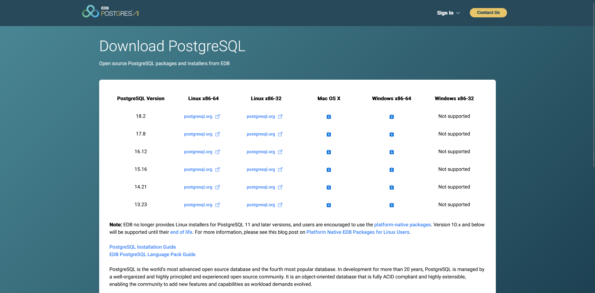
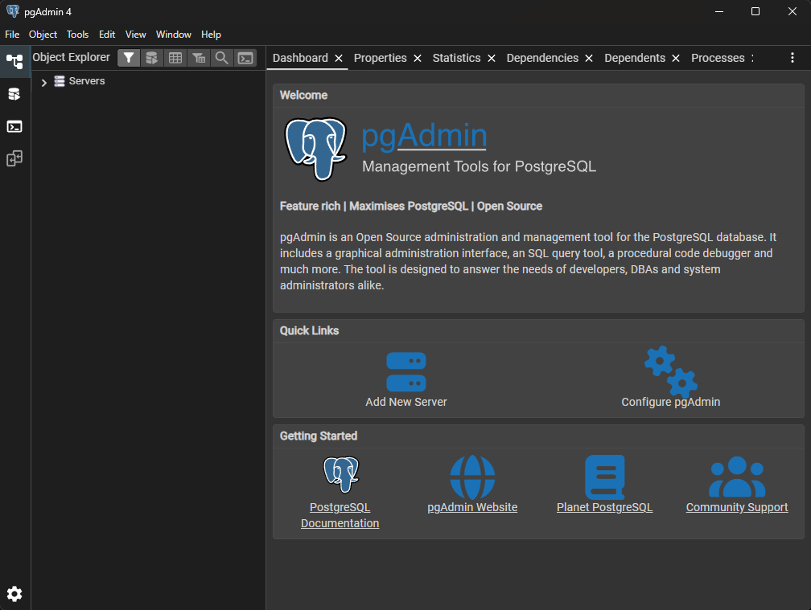
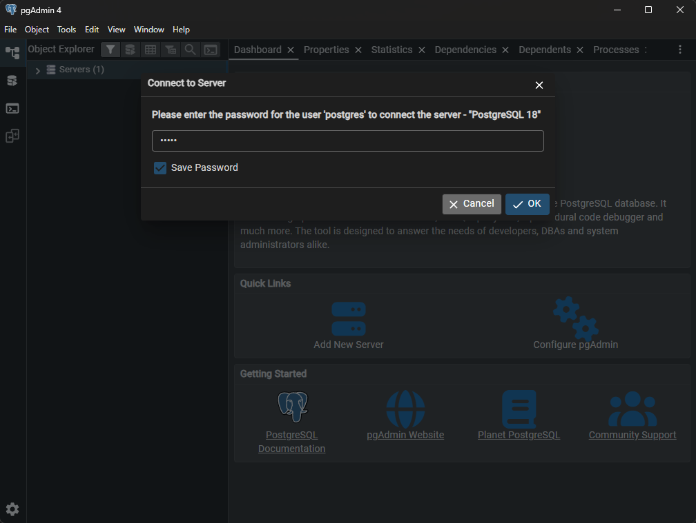
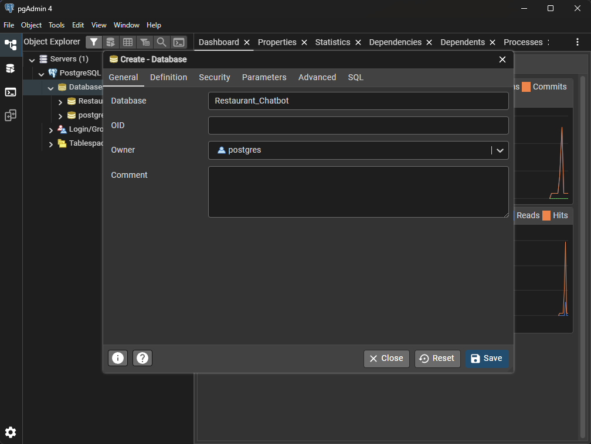
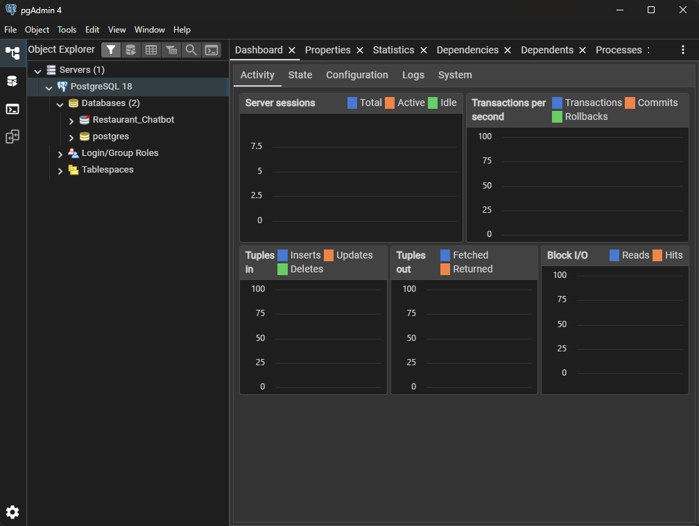

# NAI3Bot-H — Hospitality Track
## Restaurant AI Agent with Multi-Tenant Support

A professional multi-tenant restaurant AI agent built with Flask (backend) and React (frontend), using Google Gemini for RAG and agentic capabilities.

---

## System Architecture: Four-Component Stack

The application logic relies on **four distinct files/components** functioning in unison:

```
┌─────────────────────────┐
│   Admin Page (HTML)     │ ← THE INPUT LAYER
│  (RestoAdmin.jsx)       │    Handles data persistence, configuration,
│                         │    and asset uploads.
└────────────┬────────────┘
             │ 
             ↓
┌─────────────────────────┐
│      app.py             │ ← THE APPLICATION CORE
│  (backend/app.py)       │    Main Python entry point controlling
│                         │    routes and logic.
└────────┬────────────────┘
         │
         ↕
┌─────────────────────────┐
│     tools.py            │ ← THE UTILITY BELT
│ (backend/services/      │    Helper functions and scripts.
│  tools.py)              │    Includes Gemini function calls,
│                         │    menu ingestion, reservations.
└────────┬────────────────┘
         │
         ↓
┌─────────────────────────┐
│  Chatbot Page (HTML)    │ ← THE INTERFACE LAYER
│  (ClientChat.jsx)       │    Client-facing chat portal for
│                         │    communication and ordering.
└─────────────────────────┘
```

### Component Responsibilities

- **Admin Page** (`frontend/react-app/src/pages/RestoAdmin.jsx`):
  - Restaurant owners upload menus
  - Set system instructions for Gemini
  - Manage restaurant settings via `X-API-Key` header

- **app.py** (`backend/app.py`):
  - Flask factory and blueprint registration
  - Routes for super-admin, resto-admin, and client-api
  - Database initialization and migrations

- **tools.py** (`backend/services/tools.py`):
  - Gemini function calling: `check_availability()`, `create_reservation()`
  - Menu embeddings via ChromaDB
  - Tenant isolation and validation logic

- **Chatbot Page** (`frontend/react-app/src/pages/ClientChat.jsx`):
  - End-user chat interface
  - Queries backend via `/client-api/v1/chat`
  - Displays Gemini responses in real-time

---

## Environment Setup & Quick Start

### Prerequisites
- Python 3.9+
- Node.js 16+
- PostgreSQL (optional; SQLite used by default for local dev)
- Google Gemini API key

### Setup (Hospitality Track)

#### Step 1: Download & Install PostgreSQL

**1.1 Download PostgreSQL 18.2**

Visit the official PostgreSQL download page:
🔗 https://www.enterprisedb.com/downloads/postgres-postgresql-downloads

Select your operating system (Windows, macOS, or Linux) and download the latest stable version.



**1.2 Installing PostgreSQL on Windows**

1. Run the downloaded installer
2. Follow the installation wizard:
   - Accept license agreement
   - Choose installation directory (default is fine)
   - Select components (include pgAdmin for GUI management)
   - Set up port (default is 5432)


3. Create a superuser:
   - **Username**: `postgres`
   - **Password**: `admin` (use this for Restaurant_Chatbot setup)

4. Complete the installation

**1.3 Verify Installation**

Open Command Prompt or PowerShell and run:

```powershell
psql --version
```

You should see the PostgreSQL version number.

#### Step 2: Create Database & User

**2.1 Connect to PostgreSQL Using PGAdmin 4 GUI**

open pgAdmin 4



**2.2 Input Correct Password**



**2.3 Create the Restaurant Chatbot Database**


**2.4 Insert Correct Database Name**



You should see `Restaurant_Chatbot` in the list.



**2.5 Exit PostgreSQL**

Close pgAdmin 4 GUI

#### Step 3: Application Setup

**3.1 Clone the Repository**

```powershell
# Navigate to your desired location
cd C:\Users\YourUsername\Documents

# Clone the repository
git clone <repository-url>
cd NA13Bot-F
```

**3.2 Set Up Python Virtual Environment**

```powershell
# Verify Python is installed
python --version

# Create virtual environment
python -m venv env

# Activate virtual environment (Windows)
.\env\Scripts\Activate.ps1

# You should see (env) at the start of your PowerShell prompt
```

**3.3 Install Python Dependencies**

```powershell
# Ensure pip is up to date
pip install --upgrade pip setuptools wheel

# Install all required packages from requirements.txt
pip install -r requirements.txt
```

**3.4 Configure Environment Variables**

Create a `.env` file in the project root directory:

```powershell
# Create .env file
New-Item -Path .env -ItemType File

# Edit with your editor (or use Notepad)
notepad .env
```

Add the following content to `.env`:

```
# Google Gemini API
GOOGLE_API_KEY=your_gemini_api_key_here

# Database Configuration (fallback to config.json if not set)
DB_HOST=localhost
DB_PORT=5432
DB_NAME=Restaurant_Chatbot
DB_USER=postgres
DB_PASSWORD=admin
DB_SCHEMA=public
```

**3.5 Verify config.json Database Settings**

Ensure your `config.json` file has the correct database credentials:

```json
{
  "db": {
    "host": "localhost",
    "port": 5432,
    "name": "Restaurant_Chatbot",
    "user": "postgres",
    "password": "admin"
  }
}
```

**3.6 Start the Application**

```powershell
# Make sure you're in the project root directory
cd C:\Users\User\Documents\GitHub\NA13Bot-F

# Make sure virtual environment is activated (look for (env) prefix)
# If not, run: .\env\Scripts\Activate.ps1

# Start the Flask application
python app.py
```

You should see output similar to:
```
DB context: database=Restaurant_Chatbot, schema=public
 * Serving Flask app 'app'
 * Debug mode: on
 * Running on http://127.0.0.1:5000
Press CTRL+C to quit
```

**3.7 Access the Application**

Open your web browser and visit:

- **Admin Panel**: http://localhost:5000 (Restaurant management)
- **Chatbot Interface**: http://localhost:5000/chat (Customer chat)
- **API Endpoints**: http://localhost:5000/api (Backend API)

**Troubleshooting Connection Issues:**

If you get a PostgreSQL connection error (`fe_sendauth: no password supplied`):

1. Verify PostgreSQL is running (check Services on Windows)
2. Confirm credentials in `config.json` match your PostgreSQL setup
3. Test connection manually:
   ```powershell
   psql -U postgres -h localhost -d Restaurant_Chatbot
   # Enter password: admin
   ```
4. Check that the `Restaurant_Chatbot` database exists in pgAdmin

Visit:
- **Admin Panel**: http://localhost:5173 → tab "Resto Admin"
- **Chatbot**: http://localhost:5173 → tab "Client Chat"
- **API**: http://localhost:5000

---

## Project Structure

```
NAI3Bot-H (resto-ai-agent)/
├── backend/                      # FLASK APPLICATION CORE
│   ├── app.py                    # Main entry point
│   ├── config.py                 # Configuration
│   ├── extensions.py             # SQLAlchemy, Migrate init
│   ├── models/                   # Database models (Restaurant, Reservation, etc.)
│   ├── services/
│   │   ├── tools.py              # UTILITY BELT: Gemini tools, reservation logic
│   │   ├── gemini_engine.py      # Gemini session builder
│   │   └── menu_ingest.py        # Menu chunking & embedding
│   ├── blueprints/
│   │   ├── super_admin/          # Platform management (issue API keys)
│   │   ├── resto_admin/          # Restaurant config (menus, instructions)
│   │   └── client_api/           # End-user chat endpoint
│   ├── storage/
│   │   └── chroma/               # ChromaDB persistent directory
│   └── requirements.txt           # Python dependencies
│
├── frontend/                     # REACT SPA
│   ├── react-app/
│   │   ├── src/
│   │   │   ├── pages/
│   │   │   │   ├── SuperAdmin.jsx    # (optional) Create restaurants
│   │   │   │   ├── RestoAdmin.jsx    # INPUT LAYER: Admin page
│   │   │   │   └── ClientChat.jsx    # INTERFACE LAYER: Chatbot page
│   │   │   ├── components/
│   │   │   ├── api.js                # Axios client (points to Flask)
│   │   │   ├── App.jsx
│   │   │   ├── main.jsx
│   │   │   └── styles.css
│   │   ├── index.html
│   │   ├── package.json
│   │   ├── vite.config.js            # Dev proxy to Flask
│   │   └── README.md
│   └── README.md
│
├── .git/
└── .gitattributes
```

---

## Running the Application

### Backend (Flask)

```powershell
cd backend
.\nai3botvenv\Scripts\Activate.ps1
python -m backend.app
# API available at http://localhost:5000
```

### Frontend (React + Vite)

```powershell
cd frontend/react-app
npm run dev
# Dev server at http://localhost:5173 with proxy to Flask
```

---

## Key Features

- **Multi-Tenant**: Strict `restaurant_id` isolation at database and Chroma levels
- **RAG + Agentic**: Gemini embeddings + function calling for reservations
- **API-First**: Flask REST endpoints consumed by React SPA
- **Four-Component Stack**: Clean separation of admin, core, utilities, and chat
- **Production-Ready**: Factory pattern, blueprints, SQLAlchemy ORM, Chroma persistence

---

## Development Notes

PostgreSQL connection details are documented in [docs/postgres.md](docs/postgres.md).

- When `DATABASE_URL` is set, it takes precedence over all other settings.
- If you use `config.json`, make sure it is in the project root next to `config.py`.

- **Gemini API Key**: Set `GEMINI_API_KEY` env var or in `.env` (backend/) before running
- **Database**: Defaults to SQLite (`resto.db`); set `DATABASE_URL` for Postgres
- **CORS**: Vite dev proxy handles `/super-admin`, `/resto-admin`, `/client-api` → Flask
- **Tenant Resolution**: React sends `X-API-Key` or `X-Restaurant-Id` header; Flask validates and isolates